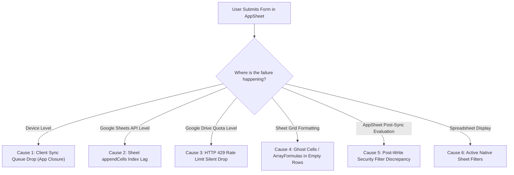

# AppSheet Database Design, Schema Architecture & Google Sheets Synergy

This guide covers relational data modeling principles optimized for AppSheet's in-memory client engine, recommended denormalization strategies, column count thresholds, a deep-dive investigation into **why rows go missing during multi-user concurrent additions in Google Sheets (and how to debug them)**, and Google Sheets/Apps Script synergy.

---

## 1. Relational Database Architecture for AppSheet

### Primary Key Architecture: Synthetic vs Natural Keys

In AppSheet, the **Key Column** is the immutable identity of a record across all sync cycles, client-side SQLite/IndexedDB local storage caches, and relational pointer arrays.

```
+---------------------------------------------------------------------------------------------------+
|                                 PRIMARY KEY DECISION FRAMEWORK                                    |
+---------------------------------------------------------------------------------------------------+
|  1. Users / Staff Table in Google Workspace?                                                      |
|     +---> YES ---> NATURAL KEY: 'Email' is SUPERIOR & RECOMMENDED (Native USEREMAIL() match).     |
|                                                                                                   |
|  2. Fixed Product / Hardware Catalog / ISO Code (USD, EUR, US, VN)?                               |
|     +---> YES ---> NATURAL KEY: 'PartNumber' / 'Code' is ACCEPTABLE (Set as Text in Sheets).       |
|                                                                                                   |
|  3. General Transactions, Work Orders, Invoices, Tasks, or Child Tables?                          |
|     +---> YES ---> SYNTHETIC KEY: 'UNIQUEID()' is MANDATORY (Collision-free, offline-ready).      |
|                                                                                                   |
|  4. Sensitive PII (SSN, Tax ID, National ID)?                                                     |
|     +---> YES ---> NEVER USE AS KEY (Use UNIQUEID() key; protect PII in restricted column).       |
+---------------------------------------------------------------------------------------------------+
```

#### Detailed Comparison & Architectural Evaluation

| Key Strategy | Best Used For | Architectural Evaluation | Verdict & Recommendation |
| :--- | :--- | :--- | :--- |
| **Natural Key: `Email`** | Dedicated `Users` / `Staff` tables in Google Workspace environments. | Direct 1:1 integration with `USEREMAIL()`. Eliminates intermediate lookup hops in Security Filters (`[AssignedTo] = USEREMAIL()`). In Google Workspace, user identities and app seats are tied directly to corporate email addresses. | **SUPERIOR & RECOMMENDED FOR `Users` TABLES**. |
| **Natural Key: `PartNumber` / `SKU` / `ISO Code`** | Fixed product catalog, currency (`USD`, `EUR`), country codes (`US`, `VN`). | Human-readable references. Ensures direct lookup in raw spreadsheet backends. **Format Rule:** Must set column to **Text** in Google Sheets (enforcing a leading apostrophe `'` or explicit text format) so leading zeroes (`01234`) are preserved and not coerced to numbers. | **ACCEPTABLE FOR STATIC CATALOGS**. |
| **`UNIQUEID()`** (AppSheet Initial Value) | All transaction, child, and business entity tables (`Orders`, `Tasks`, `Assets`, `Invoices`). | Generates an 8-character collision-free alphanumeric hash client-side before sync. Works completely offline. Immune to human typos or renumbering. | **MANDATORY BEST PRACTICE** for general tables. |
| **Natural Key: `SSN` / `TaxID` / `Phone`** | Confidential personal records. | **PII Exposure Risk:** Foreign keys are copied across dozens of child tables, leaking sensitive PII into synced client devices. | **NEVER USE AS PRIMARY KEY**. Use synthetic `UNIQUEID()` as the Key and store SSN as a separate restricted column with `Valid_If` uniqueness. |
| **`_ROWNUMBER`** | System internal row index. | Key dynamically changes whenever rows are sorted, inserted, filtered, or deleted in the backend sheet, causing severe data corruption and orphaned child records. | **CRITICAL ANTI-PATTERN**. Never use as primary key. |
| **Spreadsheet Sequential ID** (`=MAX(A:A)+1`) | Spreadsheet-only workflows. | Fails when multiple users add records offline or concurrently (generates duplicate IDs, overwriting rows). | **FATAL CONCURRENCY TRAP**. |

---

### Parent-Child Relationships & `IsPartOf` Lifecycle

In relational schemas (e.g. `Orders` $\to$ `OrderDetails`):
1. **Foreign Key Column in Child:** Create `OrderID` (Type: `Ref`, Source Table: `Orders`).
2. **`IsPartOf = TRUE`:** Set on the child's `Ref` column. This unlocks:
   - **Nested Form Entry:** Allows adding, editing, and previewing child rows directly inside the parent form view before the parent is saved.
   - **Cascading Deletes:** Deleting the parent automatically deletes all linked child rows from the database.
   - **Atomic Batch Sync:** Parent and child rows are bundled into a single sync transaction.
3. **`REF_ROWS("ChildTable", "ParentRefColumn")`:** AppSheet automatically generates a Virtual Column on the parent returning a list of child keys for parent-level rollups (`SUM([Related OrderDetails][TotalPrice])`).

---

## 2. Recommended Denormalization Strategy in AppSheet

In classical SQL (3NF), data normalization avoids storing redundant data. However, in AppSheet, computing everything at runtime via Virtual Columns creates massive $O(N \times K)$ sync bottlenecks and historical data distortion.

AppSheet applications should follow a **3-Tier Pragmatic Denormalization Architecture**:

```
+----------------------------------------------------------------------------------------------------+
|                         3-TIER APP SHEET DENORMALIZATION ARCHITECTURE                              |
+----------------------------------------------------------------------------------------------------+
|                                                                                                    |
|  TIER 1: WRITE-TIME SNAPSHOTTING (Point-in-Time Static Data)                                       |
|  ===========================================================                                       |
|  • Use for: Unit Price at order time, Customer Name on invoice, Tax Rate snapshot, Shipping Addr.  |
|  • Configuration: PHYSICAL COLUMN in sheet.                                                        |
|    - Initial Value Formula: [ParentRef].[SourceColumn]   (e.g., [ProductID].[UnitPrice])          |
|    - App Formula: LEAVE EMPTY (blank).                                                             |
|  • Benefit: Computed ONCE on form save. Stored as static text/number. Read in instant O(1) time    |
|    on all future syncs. Immune to future changes in parent product prices or customer names.       |
|                                                                                                    |
|  TIER 2: EVENT-DRIVEN BOT / ACTION ROLLUPS (Dynamic Parent Totals)                                |
|  ==================================================================                                |
|  • Use for: Order Total Amount, Current Inventory Stock Qty, Asset Latest Status.                  |
|  • Configuration: PHYSICAL COLUMN in Parent table ([TotalAmount], [CurrentStockQty]).              |
|    - AppSheet Bot on Child Row Add/Edit/Delete -> Runs Action "Set values of some columns in this  |
|      row" on the referenced parent row with formula: SUM([Related OrderDetails][Subtotal]).        |
|  • Benefit: Converts an O(N x M) virtual column recalculation across thousands of rows on every     |
|    sync into an event-driven write that ONLY executes when child line items actually change!       |
|                                                                                                    |
|  TIER 3: SLICE IN-MEMORY PROJECTIONS (Contextual Lookups & Current User)                          |
|  =======================================================================                           |
|  • Use for: Current user role, current tenant settings, active branch profile.                    |
|  • Configuration: 1-Row Slice (Current_User -> [Email] = USEREMAIL()).                            |
|    - In expressions: INDEX(Current_User[Role], 1) = "Admin"                                       |
|  • Benefit: Eliminates repetitive full-table LOOKUP() scans across views, format rules, and forms. |
|                                                                                                    |
+----------------------------------------------------------------------------------------------------+
```

### What to Denormalize vs What to KEEP Normalized

| Data Type | Strategy | Reason |
| :--- | :--- | :--- |
| **Financial / Transaction Snapshots** (Invoice unit price, historical billing address) | **Denormalize at Write-Time (Tier 1)** | Legal/accounting requirement: Historical invoices must never change if parent product prices change later. |
| **Parent Aggregates & Balances** (Order total, warehouse stock count, account balance) | **Denormalize via Event Bot (Tier 2)** | Physical column updated on change avoids quadratic $O(N \times M)$ virtual column sync freezes. |
| **High-Volatility Relational Data** (Live task assignment, real-time ticket status) | **Keep Normalized (Native `Ref`)** | Must reflect latest parent state immediately without stale cache risks. |
| **User Profile & Session Context** | **Project via Slice (Tier 3)** | Fast in-memory cache without bloating individual table columns. |

---

## 3. Table Width vs Row Count: Recommended Column Limits

AppSheet downloads **all columns of every synced row** to the client device (even if columns are hidden in views or `Show_If = FALSE`).

#### Practical Column Limits:
* **$< 30$ Columns (Optimal):** Fast sync, minimal memory usage, instant form rendering. Ideal for high-frequency operational tables.
* **$30–50$ Columns (Standard):** Typical for primary business entities (`WorkOrders`, `Projects`). Keep Virtual Columns $\le 5$.
* **$50–100$ Columns (Warning Zone):** Measurable sync slowdown on mobile devices. Separate large text blobs or audit notes.
* **$> 100$ Columns (Danger Zone / Anti-Pattern):** Massive JSON sync payload, high risk of mobile app crashes / RAM exhaustion, sluggish form scrolling.

#### Architectural Solutions for Wide Entities:
1. **1:1 Extension Table Pattern (Split Wide Tables):**
   - Instead of a single 120-column `Employees` table, split into:
     - `Employees_Core` (15 columns: `EmployeeID`, `Name`, `Email`, `Department`, `Title`, `Status`, `Photo`) $\to$ Used in all general List, Table, and Deck views.
     - `Employees_HR_Private` (50 columns: `SSN`, `BankDetails`, `Salary`, `EmergencyContacts`, `TaxInfo`) with `Ref` key `EmployeeID` and `IsPartOf = TRUE` $\to$ Loaded only in dedicated HR detail/form views.
   - *Result:* 80% reduction in sync payload for general users.
2. **Vertical Column Reduction via `EnumList`:**
   - ❌ *Anti-Pattern:* 20 separate `Yes/No` columns for permissions (`CanEditOrders`, `CanDeleteOrders`, `CanApproveRefunds`, ...).
   - ✅ *Optimized Pattern:* 1 `EnumList` column (`Permissions`) storing a comma-separated list of granted permission tags.

---

## 4. Deep Dive: Why Rows Go Missing During Concurrent Multi-User Additions in Google Sheets

When multiple users simultaneously submit new records in an AppSheet app backed by Google Sheets, rows occasionally go missing, disappear from the app, or overwrite each other.

> [!IMPORTANT]
> **Why Creating a Composite Unique ID (`UserID + UNIQUEID() + Timestamp`) Does NOT Completely Solve Missing Rows:**
> A unique composite key guarantees that **Key Collisions** will not occur. However, key collision is only **one of several distinct underlying failure modes** in Google Sheets multi-user environments. Below is the complete breakdown of all failure mechanisms and how to fix and debug them.

---

### The 6 Root Causes of Missing Rows Under Multi-User Concurrency



---

#### Cause 1: Client Sync Queue Drop / Premature Browser Tab Closure (#1 Silent Cause)
- **Mechanism:** When a user submits a form, the row is written to the device's **local client storage (IndexedDB in browser / SQLite in mobile)**. It has not yet reached Google Sheets. If `Delayed Sync` is enabled, or if the user immediately closes the browser tab, locks their phone, or goes offline before the orange sync spinner completes, the queued POST request is aborted and permanently lost.
- **Fix:**
  1. Disable `Delayed Sync` for critical transaction tables (`Settings > Performance > Delayed sync on data changes = OFF`).
  2. Educate users to wait for the sync spinner icon to finish before closing the web tab or mobile app.

---

#### Cause 2: Google Sheets API `appendCells` Index Lag & Concurrent Write Race Conditions
- **Mechanism:** Google Sheets is a spreadsheet grid, not an ACID relational database with row-level locks. When 5–10 users submit rows within milliseconds:
  1. User A's sync request calls Google Sheets API `AppendCells`. The API determines the last occupied row is Row 100 and prepares to write to Row 101.
  2. User B's sync request arrives simultaneously. Because Google Sheets formula recalculations and API indexing take 500–1500ms to commit, the API also identifies Row 100 as the last occupied row and writes User B's data to **Row 101**, overwriting User A's row.
- **Fix:** For apps with high concurrent write volume (>10 simultaneous active field users saving records continuously), migrate the backend from Google Sheets to **Google Cloud SQL (PostgreSQL / MySQL)**.

---

#### Cause 3: Ghost Formatted Cells & Blank Rows Below Data
- **Mechanism:** If someone dragged formatting (borders, background color) or formulas (e.g. `=IF(A2="","",...)`) down to row 1,000 in Google Sheets:
  - The Google Sheets API considers rows 2 through 1,000 as **occupied**.
  - When AppSheet appends a new row, it scans for the first unoccupied row and writes to **Row 1,001**, leaving 900 blank rows in between.
  - On subsequent syncs, AppSheet's data fetcher stops reading when it hits the blank row threshold, causing the newly added row at Row 1,001 to appear completely "missing" in the app!
- **Fix:**
  1. Open Google Sheets, select all empty rows below your actual data, right-click, and select **Delete rows**.
  2. Never drag formulas down empty rows. Use **`ARRAYFORMULA`** in Row 1 only.

---

#### Cause 4: Google Drive API Rate Limits (`HTTP 429 Too Many Requests`)
- **Mechanism:** Google Workspace imposes a rate limit of 300 write requests per minute per project on the Google Drive / Sheets API. If multiple users, background bots, webhook actions, and image uploads execute concurrently, Google rejects requests with `HTTP 429 Too Many Requests`. If background retries exhaust, the row addition is dropped.
- **Fix:** Enable **Server Caching** for read-only tables and batch non-urgent automated bot notifications.

---

#### Cause 5: Post-Write Security Filter Discrepancy (Row Added but Invisible)
- **Mechanism:** The row is successfully written to Google Sheets. However, immediately after writing, a Bot or sheet formula updates a field (e.g., changes `[Status]` from `"New"` to `"In Review"`, or reassigns `[AssignedTo]`). When the user's app finishes syncing, the table's **Security Filter** (e.g., `[AssignedTo] = USEREMAIL()`) evaluates to `FALSE`, instantly removing the row from the user's view. The user believes the row was lost.
- **Fix:** Verify table Security Filters and Slices to ensure newly created records remain visible under the current user's security filter criteria.

---

#### Cause 6: Active Native Filters in Google Sheets (Not Filter Views)
- **Mechanism:** If a manager applies a standard Google Sheet column filter (e.g., Filter by `Status = "Active"`), new rows appended by AppSheet with a different status are hidden by Google Sheets' native display filter.
- **Fix:** Never use standard Filters on AppSheet backend spreadsheets. Use **Filter Views** (`Data > Filter views > Create new filter view`), which do not affect the backend grid for other users or API integrations.

---

### Step-by-Step Debugging Protocol for Missing Rows

When a user reports a missing row, follow this diagnostic checklist in order:

1. **Step 1: Check AppSheet Audit History (Server-Side Trace):**
   - Go to **Manage > Monitor > Audit History**.
   - Filter by the user's email address and time range.
   - **If no `Add Row` record exists:** The failure is **Cause 1** (Client sync queue dropped due to premature app/tab closure).
   - **If an `Add Row` record exists with an error code (429, 503):** The failure is **Cause 4** (API quota exhaustion).
   - **If an `Add Row` record exists with status `Success`:** Proceed to Step 2.
2. **Step 2: Inspect Google Sheets Version History (Backend Trace):**
   - Open the Google Sheet $\to$ **File > Version history > See version history**.
   - Check the exact timestamp when AppSheet wrote the row:
     - **If row data was written and later overwritten:** The failure is **Cause 2** (Concurrent append race condition).
     - **If row data is present at a distant row index (e.g., Row 1500):** The failure is **Cause 3** (Ghost formatted cells/formulas).
     - **If row data is present in the sheet right now:** Proceed to Step 3.
3. **Step 3: Check Security Filters & Slices (Visibility Trace):**
   - Check the table's Security Filter and active View Slice in AppSheet. If the row's values do not satisfy `SecurityFilter` for that user, the row is safely stored in the sheet but intentionally hidden from the app.

---

### Concurrency Prevention Checklist
1. **Primary Key Initial Value:** Set to `UNIQUEID()` or `UNIQUEID("UUID")`. Never use `=MAX()+1` or row numbers.
2. **Delayed Sync:** Turn OFF `Delayed Sync` for audit or transactional tables to force immediate backend flushing.
3. **Form Submissions:** Enable auto-save on forms (`Auto save = ON`) and advise users to verify the sync spinner completes before closing the app.
4. **Sheet Hygiene:** Delete all blank trailing rows and columns in the Google Sheet. Ensure `ARRAYFORMULA` calculations reside in row 1 only.
5. **High Concurrency Migration:** When more than 10 users actively write rows concurrently, migrate backend storage to **Cloud SQL** (PostgreSQL/MySQL).

---

## 5. Google Sheets Synergy & Backend Tuning

### Rule of Spreadsheet Formulas vs AppSheet Formulas
| Capability | Google Sheets Formula | AppSheet Formula | Recommended Best Practice |
| :--- | :--- | :--- | :--- |
| **Row Calculations** | `=B2*C2` dragged down | App Formula: `[Quantity] * [UnitPrice]` | **AppSheet App Formula**. Eliminates sheet calculation lag. |
| **Array Auto-Expansion** | `ARRAYFORMULA(IF(ROW(A:A)=1, "Total", ...))` in Row 1 | N/A | **ARRAYFORMULA in Row 1 only**. Safe for read-only reporting. |
| **Volatile Functions** | `=TODAY()`, `=NOW()`, `=RAND()` | `TODAY()`, `NOW()`, `UNIQUEID()` | **Never put volatile functions in Google Sheets**. They force a full sheet recalculation on every edit. |
| **Lookups across sheets** | `=VLOOKUP(...)`, `=QUERY(...)` | `LOOKUP(...)`, Dereference `[Ref].[Col]` | **AppSheet Dereferencing**. Avoids Sheet lookup freezes. |

---

### Google Apps Script Integration
AppSheet Automations can invoke Google Apps Script directly with zero authentication setup:

#### Use Case: Call Apps Script from AppSheet Bot Task
1. In AppSheet Bot, add a Task with type: **`Call a script`**.
2. Select your Google Apps Script project.
3. Pass AppSheet column parameters into the Apps Script function:
   ```javascript
   function generateCustomGoogleDoc(orderId, customerName, totalAmount) {
     var templateDoc = DriveApp.getFileById("TEMPLATE_DOC_ID");
     var newDoc = templateDoc.makeCopy("Invoice_" + orderId);
     var body = DocumentApp.openById(newDoc.getId()).getBody();
     body.replaceText("<<ORDER_ID>>", orderId);
     body.replaceText("<<CUSTOMER_NAME>>", customerName);
     body.replaceText("<<TOTAL>>", totalAmount);
     return newDoc.getUrl();
   }
   ```
4. Capture return values in AppSheet to update the row with the generated Document URL.

---

### Sheet Performance & Storage Hygiene Rules
1. **Trim the Grid:**
   - Default Google Sheets create 1,000 rows $\times$ 26 columns (26,000 cells). If your table only has 50 rows and 8 columns, delete rows 51–1000 and columns I–Z.
   - Google Sheets allocates memory for every cell in the grid. Trimming unused cells speeds up API read/write operations by up to 500ms per call.
2. **Isolate Backend Data from Reporting Dashboards:**
   - Keep raw AppSheet tables on dedicated tabs with zero cell formatting, zero conditional formatting, and zero pivot tables.
   - Build reporting dashboards and charts on separate linked sheets or in Looker Studio reading from the raw data.
